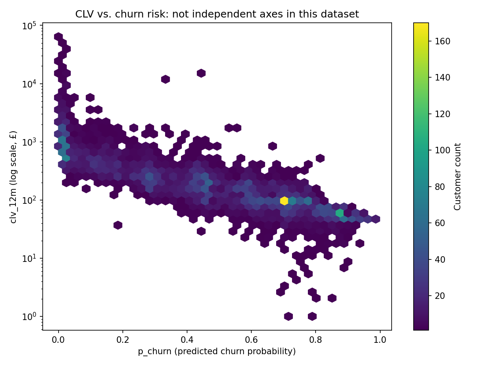

# CLV, Churn, and Risk-Weighted Retention Budgeting

## Problem statement

A retention team has a fixed budget and needs to decide which customers to spend it
on. Spending it on your most valuable customers wastes money on people who were never
going to leave; spending it on your highest-risk customers wastes money on people who
are cheap to flag as risky but not worth saving. The right target is the customer
where the *expected value of intervening* is highest: someone who is both valuable
and genuinely at risk. This project builds that number for every customer in the UCI
Online Retail II dataset by combining a probabilistic lifetime-value model (BG/NBD +
Gamma-Gamma) with a calibrated churn classifier (XGBoost), and shows -- not just
asserts -- that ranking by the combined signal beats either model used alone.

## Pipeline

```
dataset/raw/online-retail-II.xlsx
        │
        ▼
src/load.py       clean order lines -> one row per (customer_id, invoice)
        │
        ▼
src/rfm.py         calibration/holdout split -> RFM summary + proxy churn labels
        │
        ▼
src/btyd.py         BG/NBD (purchase timing) + Gamma-Gamma (spend) -> clv_12m, p_alive
        │
        ▼
src/features.py     calibration-only feature matrix for the churn classifier
        │
        ▼
src/churn.py         XGBoost churn classifier, benchmarked against 4 baselines -> p_churn
        │
        ▼
src/allocate.py      clv_12m x p_churn -> risk-weighted retention budget allocation
```

Run the whole thing with `python -m src.cli all` (see Reproduction below). Every
stage caches its output as parquet under `dataset/interim/` or `dataset/processed/`
and is skipped on the next run unless `--force` is passed.

## Modelling choices and caveats

**Why BG/NBD.** Online Retail II is non-contractual: customers don't cancel a
subscription, they just stop ordering. BG/NBD is built for exactly that setting -- a
Beta-distributed per-customer dropout probability combined with a Gamma-distributed
purchase rate -- rather than assuming a fixed contract term the way a survival model
for subscription churn would.

**The churn label is a proxy, not ground truth.** In a non-contractual setting,
"churn" is never directly observed -- there is no cancellation event, only the
absence of a future purchase. This project labels a customer `churned=1` if they made
zero purchases in the 183-day holdout window (2011-06-09 to 2011-12-09). That is a
proxy with a real failure mode: a wholesaler on a nine-month reorder cycle looks
identical to a genuinely lost customer under a six-month window. Of the 3,326 repeat
buyers in the calibration window, **329 (9.9%)** have a historical average
inter-purchase gap longer than the holdout window itself -- their churn label is
known-suspect. Customers whose first purchase fell in the last 60 days before
calibration_end (**218 customers, 4.4%**) are flagged `is_new_cohort` for the same
reason (almost no observable history) but are not silently dropped.

The clearest evidence of this proxy-label problem showing up empirically: BG/NBD
assigns `p_alive = 1.0` identically to every customer with zero repeat purchases (a
mathematical property of the model, confirmed on all 1,615 one-time buyers in this
data), yet 73.1% of those same one-time buyers are labelled "churned" by the 6-month
window simply because they haven't had time to reorder yet. That collision drives the
pooled `1 - p_alive` baseline AUC **below 0.5** (0.412) -- a degenerate number, not a
baseline anyone should be benchmarked against. Restricted to a held-out split of
repeat buyers only (the population BG/NBD is actually valid for), the same score
reaches **AUC 0.728**. See the `repeat_buyers_only` track in `reports/churn_metrics.csv`
(produced by `src/churn.py::train_churn_model`) for the full comparison this collision
motivates -- the pooled and repeat-buyer-only numbers are not interchangeable, and the
project reports incremental AUC only within the repeat-buyer track for exactly this
reason (see Churn model results below).

**Data loss from dropping anonymous transactions.** 23.1% of order lines
(234,437 of 1,013,932 post-cancellation-split rows) have no `customer_id` and are
dropped, since every downstream model operates per customer. This is the single
largest data-loss step in the pipeline and is unavoidable for customer-level
modelling -- it is not a bug, and it means the analysis covers roughly three-quarters
of gross transaction volume, not all of it.

**Gross margin is an assumption.** `clv_12m` is 12-month discounted revenue scaled by
a **0.30 gross-margin** assumption from `config.yaml` -- revenue is not profit, and no
per-SKU cost data exists in this dataset to derive a real margin. Every CLV and
allocation number in this README should be read as "at an assumed 30% margin."

**Gamma-Gamma independence check.** Gamma-Gamma assumes purchase frequency and
monetary value are independent given a customer's latent parameters. The Pearson
correlation between `frequency` and `monetary_value` on the 3,326 repeat-buyer
training subset is **r = 0.081** -- comfortably under the 0.10 warning threshold used
in this project, so the assumption holds well enough here to trust `expected_avg_value`
and `clv_12m`.

**The uplift assumption is untested.** `expected_save = clv_12m * p_churn * uplift -
cost` requires an assumed relative reduction in churn probability from intervening
(`uplift`, default 0.20 in config). There was no randomised holdout test of any
retention offer in this dataset, so this number cannot be estimated from the data --
it is asserted, not measured. `src/allocate.py::sensitivity_analysis` sweeps uplift
over {0.05, 0.10, 0.20, 0.30, 0.50} and cost over {2.5, 5.0, 7.5, 10.0, 15.0} and
produces `reports/figures/allocation_sensitivity_heatmap.png` specifically to bracket
the answer instead of hiding the assumption. **The only rigorous way to learn the true
uplift is a randomised A/B test on the targeted segment** -- offer the intervention to
a random half of the customers `allocate.py` would select, withhold it from the other
half, and measure the actual difference in realised churn.

## BG/NBD holdout validation

Predicted vs. actual purchases in the 183-day holdout window, bucketed by
calibration-period frequency (MAE = 1.040, RMSE = 1.785 across 4,941 customers):

| Calibration frequency | Customers | Mean predicted | Mean actual | Abs. error |
|---:|---:|---:|---:|---:|
| 0  | 1,615 | 0.490 | 0.452 | 0.038 |
| 1  |   879 | 0.753 | 0.747 | 0.005 |
| 2  |   563 | 1.087 | 1.121 | 0.034 |
| 3  |   408 | 1.292 | 1.279 | 0.012 |
| 4  |   312 | 1.617 | 1.670 | 0.053 |
| 5  |   194 | 1.874 | 1.840 | 0.033 |
| 6  |   183 | 2.089 | 1.978 | 0.111 |
| 7+ |   787 | 4.750 | 5.084 | 0.334 |


This is the artifact that demonstrates the model was validated against held-out data,
not just fitted: predicted and actual purchase counts track closely across every
frequency bucket, including the long tail of high-frequency wholesale-style buyers.

## Churn model results

**Proxy-churn base rate:** 47.9% overall (4,941 customers) -- but that single number
hides two very different populations: **73.1%** among the 1,615 one-time buyers (who
mostly haven't had time to reorder, not genuinely lost) vs. **35.6%** among the 3,326
repeat buyers. Every AUC/Brier number below should be read against the population it
was computed on, not the pooled rate.

This project evaluates the churn classifier on **two tracks**, not one: **pooled** (all
4,941 customers, an 80/20 stratified split, 989-customer test set) and
**repeat-buyers-only** (the 3,326 customers with calibration-window frequency > 0, its
own independent 80/20 split, 666-customer test set). The repeat-buyer track exists
because the pooled `1 - p_alive` baseline is degenerate (see the proxy-label section
above) -- BG/NBD assigns `p_alive = 1.0` identically to every one-time buyer, which
collides with the 73.1% of them labelled "churned" by the proxy and drags the pooled
`1 - p_alive` AUC to 0.412, *below random*. Benchmarking XGBoost's contribution against
a below-random reference inflates every "incremental AUC" computed against it -- the
giveaway in an earlier version of this table was a Majority-class row showing +0.088
incremental AUC, which is impossible by construction (majority class has zero
discriminative signal). Incremental AUC is therefore reported **only** on the
repeat-buyer track, against its own real 1−p_alive reference.

**Pooled track** (5-fold CV AUC for the tuned XGBoost: 0.8125 ± 0.0115):

| Model | AUC | Brier |
|---|---:|---:|
| Majority class | 0.500 | 0.250 |
| 1 − p_alive (BG/NBD, no ML) | 0.412 *(degenerate -- see above, not a baseline)* | -- |
| Recency alone | 0.767 | -- |
| Logistic regression (RFM primitives) | 0.798 | 0.183 |
| XGBoost (tuned, raw) | 0.810 | 0.179 |
| **XGBoost (tuned, isotonic calibrated)** | **0.810** | **0.178** |

**Repeat-buyers-only track** (5-fold CV AUC: 0.7895 ± 0.0137) -- this is the fair
comparison, because it's the population BG/NBD's `p_alive` is actually valid for:

| Model | AUC | Brier | Incremental AUC over `1 − p_alive` |
|---|---:|---:|---:|
| Majority class | 0.500 | 0.229 | n/a *(no signal by construction -- see note)* |
| **1 − p_alive (BG/NBD, no ML)** | **0.728** | -- | +0.000 (reference) |
| Recency alone | 0.719 | -- | −0.009 |
| Logistic regression (RFM primitives) | 0.760 | 0.190 | +0.033 |
| XGBoost (tuned, raw) | 0.798 | 0.189 | +0.071 |
| **XGBoost (tuned, isotonic calibrated)** | **0.796** | **0.175** | **+0.068** |

The XGBoost increment is **+0.068 AUC, 95% CI [+0.042, +0.094], p = 0.001** (paired
bootstrap, 2,000 resamples, same 666 held-out customers for both scores). It's real,
but modest -- and that's expected: `p_alive` is itself one of XGBoost's input
features, so +0.068 is the incremental value of the calibration-window basket,
breadth, and trend features layered *on top of* BG/NBD's signal, not XGBoost
re-deriving that signal from scratch. (Full mechanism: `p_churn` correlates at
ρ ≈ −0.85 with both `recency_ratio` and `purchase_rate` alone -- see Segment summary
below -- which leaves little headroom for anything else to add.)

Note the two baseline orderings differ: on the pooled population, raw recency (0.767)
beats the degenerate pooled `1 - p_alive` (0.412) by a wide margin. On repeat buyers,
that flips -- `1 - p_alive` (0.728) beats raw recency (0.719). On the population BG/NBD
is actually valid for, its dropout-process structure edges out a single recency
number, which is the result you'd hope for from a purpose-built model.

**Calibration is applied unconditionally, not gated behind a threshold.** A prior
version wrapped the tuned model in `CalibratedClassifierCV(isotonic)` only if its raw
Brier exceeded a 0.05 config threshold -- but at this dataset's ~48% base rate, the
majority-class Brier alone is ~0.25, five times that threshold, so the conditional
fired on every run regardless of the model's actual calibration and was decorative.
`src/churn.py::calibrate_model` now always calibrates and always reports both raw and
calibrated metrics (both rows above), because `allocate.py` multiplies `clv_12m` by
`p_churn` directly -- a well-ranked but poorly-calibrated probability would silently
distort the retention budget regardless of whether some threshold happened to fire.

SHAP feature importance (`reports/figures/shap_summary.png`, recomputed against the
current model) puts `recency_ratio`, `purchase_rate`, and `days_since_last_purchase`
at the top, with `p_alive` ranking 5th behind `n_distinct_months_active` --
consistent with the incremental-AUC framing above: BG/NBD contributes real signal, and
XGBoost adds calibration-window basket, breadth, and trend features on top of it.

## Retention budget allocation

### CLV and churn risk are not independent axes in this dataset

Before the strategy comparison, the finding that shapes how to read it: `clv_12m` and
`p_churn` are not two independent signals here, they are **largely the same signal
viewed twice**. Spearman rank correlation between them is **ρ = −0.885** -- not
"correlated," effectively close to the same variable measured twice. A chi-square test
on the 3×3 CLV-tercile × risk-tercile contingency table rejects independence outright
(χ² = 3931.36, dof = 4, p < 0.001), though at n≈4,900 that test was always going to
reject; the coefficient (ρ = −0.885) is the finding, not the p-value.

The mechanism is structural, not coincidental: both quantities load heavily on the
same two RFM primitives --

| | vs. `recency_ratio` | vs. `purchase_rate` |
|---|---:|---:|
| `clv_12m` | ρ = +0.656 | ρ = +0.700 |
| `p_churn` | ρ = −0.850 | ρ = −0.853 |

-- because both are, by construction, functions of the same calibration-window
purchase history: BG/NBD's `p_alive` and `clv_12m` are fit directly on
frequency/recency/T, and the churn features are engineered from that same history.
This is expected behaviour for non-contractual transactional retail data, not a data
quality problem -- a contractual setting with observed cancellations and richer
covariates would likely separate the two signals more. Full stats and the
observed-vs-expected contingency tables: `reports/clv_risk_dependence.txt`.



**Practical consequence:** the "valuable and genuinely at risk" quadrant that
motivates risk-weighted targeting in the first place is nearly empty --
**9 of 4,941 customers**. The allocation below is mostly separating "worth the
intervention cost" from "not worth it" along one value/engagement axis, rather than
resolving a genuine tension between two independent signals.

| CLV | Risk | Customers | Mean CLV | Mean p(churn) | Recommended action |
|---|---|---:|---:|---:|---|
| High | High | 9 | £401 | 0.725 | Priority retention outreach |
| High | Medium | 279 | £427 | 0.459 | Proactive check-in |
| High | Low | 1,359 | £1,136 | 0.109 | Loyalty rewards / monitor |
| Medium | High | 361 | £128 | 0.724 | Targeted save offer |
| Medium | Medium | 1,000 | £163 | 0.503 | Standard lifecycle nurture |
| Medium | Low | 286 | £199 | 0.266 | Light-touch engagement |
| Low | High | 1,255 | £64 | 0.807 | Low-cost automated save offer, or deprioritize |
| Low | Medium | 390 | £77 | 0.572 | Monitor only |
| Low | Low | 2 | £67 | 0.257 | No action needed |

Full table: `reports/segment_summary.csv`. Full per-customer allocation:
`reports/allocation.csv`.

### What each ranking selects

At the default assumptions (`total_budget=5000`, `cost_per_customer=5.0`,
`uplift=0.20`), four rankings were compared selecting the same ~1,000 customers from
the same £5,000 budget:

| Strategy | Net value (risk-weighted objective) | Mean selected CLV | Mean selected p(churn) |
|---|---:|---:|---:|
| Random selection | 9,338 ± 727 *(std, 100 resamples)* | £409 | 0.477 |
| Top-CLV only (ignores risk) | 11,978 | £1,457 | 0.091 |
| Top-churn-risk only (ignores value) | 6,177 | £68 | 0.839 |
| **Risk-weighted `expected_save` ranking** | **25,682** | £812 | 0.452 |


**This table is not a measurement of realised lift.** "Net value" is computed from
`clv_12m × p_churn × uplift`, the exact quantity the risk-weighted strategy is built to
maximise -- a strategy cannot lose a contest scored on its own objective function, so
risk-weighted "winning" here is arithmetic, not empirical evidence. The only rigorous
way to measure real lift is the randomised holdout test described in the caveats
above. What the table *does* legitimately show is what each ranking selects, and the
extra columns make both naive strategies' failure modes symmetric and quantified
rather than one asserted and one not:

- **Top-churn-risk-only** selects customers worth only **£68 on average** (vs. £409
  random) -- there's little value to protect in the first place, given the CLV/risk
  collapse above, so the flat per-customer cost eats most of their small expected
  return. That's why this strategy nets *below random selection*.
- **Top-CLV-only** selects customers with mean p(churn) of just **0.091** (vs. 0.477
  random) -- despite averaging £1,457 in CLV (1.8× the risk-weighted strategy), at
  ρ = −0.885 the highest-CLV customers are almost by construction the lowest-risk
  ones, so there's little expected loss left to prevent.

Both are the same CLV/risk collapse, viewed from opposite ends of the ranking. Full
notes and derivation: `reports/allocation_strategy_notes.txt`.

The uniform-cost allocation (`allocate_uniform_cost`) is a sort by `expected_save`,
not an optimiser -- with identical per-customer cost this is provably optimal, so it
is not dressed up as more than it is. A variable-cost path is also implemented
(`allocate_variable_cost_knapsack`) as a greedy-ratio approximation to 0/1 knapsack,
using an illustrative cost that scales mildly with predicted purchase frequency; it
selected 863 of 4,263 eligible customers, spending £4,996.90 of the £5,000 budget.


## Reproduction

```bash
pip install -r requirements.txt
# place the UCI Online Retail II workbook at dataset/raw/online-retail-II.xlsx
python -m src.cli all            # runs load -> rfm -> btyd -> features -> churn -> allocate
python -m src.cli all --force    # recompute every stage from scratch
python -m pytest tests/          # 18 unit tests
```

`requirements.txt` pins exact versions (`==`, not `>=`) for the whole verified working
set, including transitive packages that broke a fresh install (`numba`, `pytensor`,
`arviz`) -- an unpinned resolve previously landed on a numpy/pytensor/scikit-learn/
xgboost combination that didn't import at all. `pip check` reports no conflicts against
the pinned set.

Every module is also independently runnable and importable, e.g. `python -m
src.btyd --force`. All tunable numbers (calibration/holdout dates, MCMC sampler
settings, gross margin, XGBoost search space, retention budget) live in
`config.yaml`, read through `src/config.py` -- there are no magic numbers in module
bodies. Seeds are set for numpy, XGBoost, and PyMC, so reruns reproduce -- see the
Churn model results section above for how tightly: re-running the tuned XGBoost under
an upgraded dependency stack reproduced pooled AUC to 4 decimal places and moved
individual `p_churn` values by at most ~5×10⁻⁸ (floating-point noise from the
xgboost version bump, not a behavioural change).

## Dataset

Chen, D. (2019). *Online Retail II*. UCI Machine Learning Repository.
https://doi.org/10.24432/C5CG6D. Licensed CC BY 4.0.
