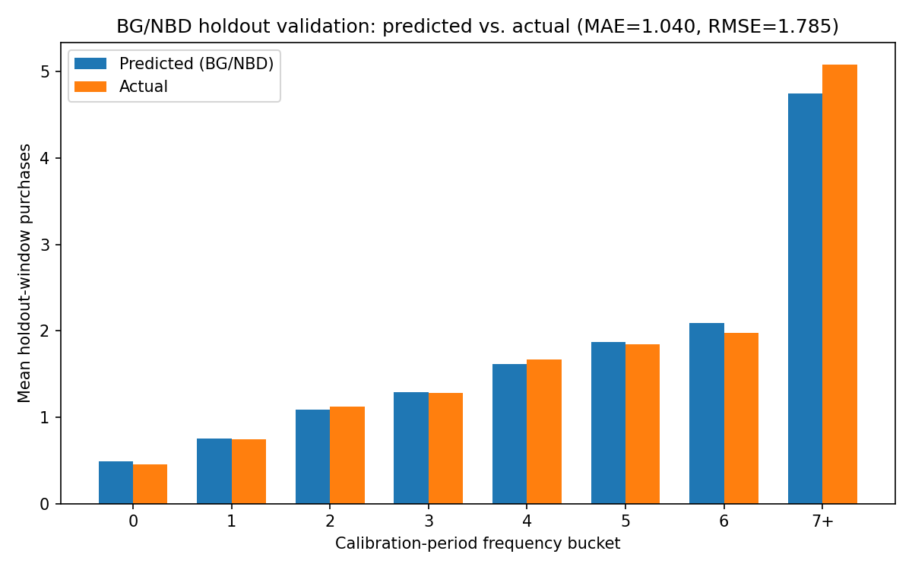
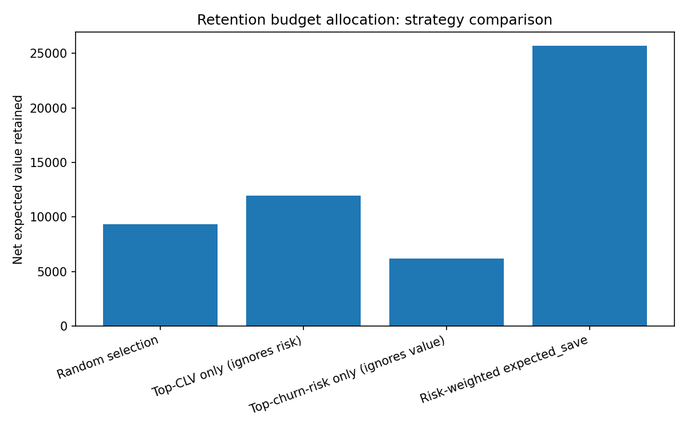
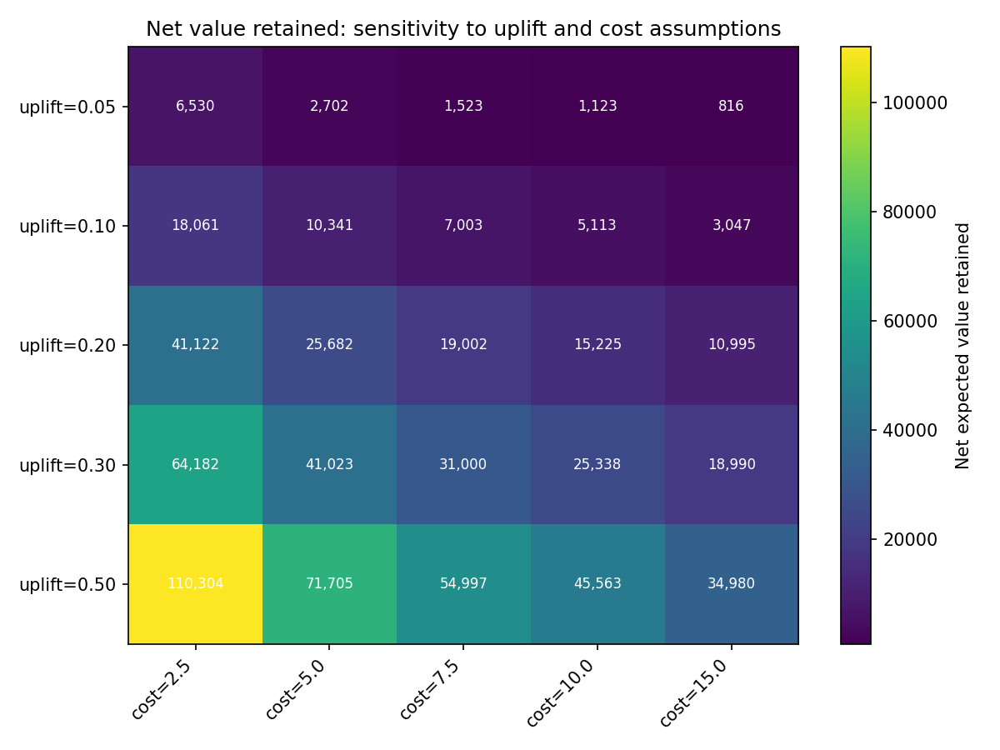

# CLV, Churn, and Risk-Weighted Retention Budgeting

## Problem statement

A retention team has a fixed budget and needs to decide which customers to spend it
on. Spending it on your most valuable customers wastes money on people who were never
going to leave; spending it on your highest-risk customers wastes money on people who
are cheap to flag as risky but not worth saving. The right target is the customer
where the *expected value of intervening* is highest: someone who is both valuable
and genuinely at risk. This project builds that number for every customer in the UCI
Online Retail II dataset by combining a probabilistic lifetime-value model (BG/NBD +
Gamma-Gamma) with a calibrated churn classifier (XGBoost), and shows -- not just
asserts -- that ranking by the combined signal beats either model used alone.

## Pipeline

```
dataset/raw/online-retail-II.xlsx
        │
        ▼
src/load.py       clean order lines -> one row per (customer_id, invoice)
        │
        ▼
src/rfm.py         calibration/holdout split -> RFM summary + proxy churn labels
        │
        ▼
src/btyd.py         BG/NBD (purchase timing) + Gamma-Gamma (spend) -> clv_12m, p_alive
        │
        ▼
src/features.py     calibration-only feature matrix for the churn classifier
        │
        ▼
src/churn.py         XGBoost churn classifier, benchmarked against 4 baselines -> p_churn
        │
        ▼
src/allocate.py      clv_12m x p_churn -> risk-weighted retention budget allocation
```

Run the whole thing with `python -m src.cli all` (see Reproduction below). Every
stage caches its output as parquet under `dataset/interim/` or `dataset/processed/`
and is skipped on the next run unless `--force` is passed.

## Modelling choices and caveats

**Why BG/NBD.** Online Retail II is non-contractual: customers don't cancel a
subscription, they just stop ordering. BG/NBD is built for exactly that setting -- a
Beta-distributed per-customer dropout probability combined with a Gamma-distributed
purchase rate -- rather than assuming a fixed contract term the way a survival model
for subscription churn would.

**The churn label is a proxy, not ground truth.** In a non-contractual setting,
"churn" is never directly observed -- there is no cancellation event, only the
absence of a future purchase. This project labels a customer `churned=1` if they made
zero purchases in the 183-day holdout window (2011-06-09 to 2011-12-09). That is a
proxy with a real failure mode: a wholesaler on a nine-month reorder cycle looks
identical to a genuinely lost customer under a six-month window. Of the 3,326 repeat
buyers in the calibration window, **329 (9.9%)** have a historical average
inter-purchase gap longer than the holdout window itself -- their churn label is
known-suspect. Customers whose first purchase fell in the last 60 days before
calibration_end (**218 customers, 4.4%**) are flagged `is_new_cohort` for the same
reason (almost no observable history) but are not silently dropped.

The clearest evidence of this proxy-label problem showing up empirically: BG/NBD
assigns `p_alive = 1.0` identically to every customer with zero repeat purchases (a
mathematical property of the model, confirmed on all 1,615 one-time buyers in this
data), yet 73.1% of those same one-time buyers are labelled "churned" by the 6-month
window simply because they haven't had time to reorder yet. That collision drives the
pooled `1 - p_alive` baseline AUC **below 0.5** (0.412) even though, restricted to
repeat buyers only, the same score reaches **AUC 0.746** -- right where a churn score
built on recency/frequency/tenure should land. See `src/churn.py::compute_baselines`
for the diagnostic that surfaces this on every run.

**Data loss from dropping anonymous transactions.** 23.1% of order lines
(234,437 of 1,013,932 post-cancellation-split rows) have no `customer_id` and are
dropped, since every downstream model operates per customer. This is the single
largest data-loss step in the pipeline and is unavoidable for customer-level
modelling -- it is not a bug, and it means the analysis covers roughly three-quarters
of gross transaction volume, not all of it.

**Gross margin is an assumption.** `clv_12m` is 12-month discounted revenue scaled by
a **0.30 gross-margin** assumption from `config.yaml` -- revenue is not profit, and no
per-SKU cost data exists in this dataset to derive a real margin. Every CLV and
allocation number in this README should be read as "at an assumed 30% margin."

**Gamma-Gamma independence check.** Gamma-Gamma assumes purchase frequency and
monetary value are independent given a customer's latent parameters. The Pearson
correlation between `frequency` and `monetary_value` on the 3,326 repeat-buyer
training subset is **r = 0.081** -- comfortably under the 0.10 warning threshold used
in this project, so the assumption holds well enough here to trust `expected_avg_value`
and `clv_12m`.

**The uplift assumption is untested.** `expected_save = clv_12m * p_churn * uplift -
cost` requires an assumed relative reduction in churn probability from intervening
(`uplift`, default 0.20 in config). There was no randomised holdout test of any
retention offer in this dataset, so this number cannot be estimated from the data --
it is asserted, not measured. `src/allocate.py::sensitivity_analysis` sweeps uplift
over {0.05, 0.10, 0.20, 0.30, 0.50} and cost over {2.5, 5.0, 7.5, 10.0, 15.0} and
produces `reports/figures/allocation_sensitivity_heatmap.png` specifically to bracket
the answer instead of hiding the assumption. **The only rigorous way to learn the true
uplift is a randomised A/B test on the targeted segment** -- offer the intervention to
a random half of the customers `allocate.py` would select, withhold it from the other
half, and measure the actual difference in realised churn.

## BG/NBD holdout validation

Predicted vs. actual purchases in the 183-day holdout window, bucketed by
calibration-period frequency (MAE = 1.040, RMSE = 1.785 across 4,941 customers):

| Calibration frequency | Customers | Mean predicted | Mean actual | Abs. error |
|---:|---:|---:|---:|---:|
| 0  | 1,615 | 0.490 | 0.452 | 0.038 |
| 1  |   879 | 0.753 | 0.747 | 0.005 |
| 2  |   563 | 1.087 | 1.121 | 0.034 |
| 3  |   408 | 1.292 | 1.279 | 0.012 |
| 4  |   312 | 1.617 | 1.670 | 0.053 |
| 5  |   194 | 1.874 | 1.840 | 0.033 |
| 6  |   183 | 2.089 | 1.978 | 0.111 |
| 7+ |   787 | 4.750 | 5.084 | 0.334 |



This is the artifact that demonstrates the model was validated against held-out data,
not just fitted: predicted and actual purchase counts track closely across every
frequency bucket, including the long tail of high-frequency wholesale-style buyers.

## Churn model results

989-customer held-out test set (80/20 stratified split; 5-fold stratified CV AUC for
the tuned XGBoost was 0.8125 ± 0.0115). The honest framing: **BG/NBD's `p_alive` is
already a meaningful churn signal on its own (AUC 0.746 among repeat buyers), so
XGBoost's contribution is judged by its incremental AUC over that baseline, not
reported as if the baseline were zero.**

| Model | AUC | Brier | Incremental AUC over `1 - p_alive` |
|---|---:|---:|---:|
| Majority class | 0.500 | 0.250 | +0.088 |
| 1 − p_alive (BG/NBD, no ML) | 0.412 | -- | +0.000 (reference) |
| Recency alone | 0.767 | -- | +0.355 |
| Logistic regression (RFM primitives) | 0.798 | 0.183 | +0.386 |
| **XGBoost (tuned, isotonic calibrated)** | **0.810** | **0.178** | **+0.398** |

The tuned XGBoost's raw Brier score (0.1785) exceeded the 0.05 calibration threshold
in `config.yaml`, so it was automatically wrapped in `CalibratedClassifierCV(isotonic)`
per `src/churn.py::calibrate_if_needed` (raw AUC 0.8097 -> calibrated 0.8103; Brier
0.1785 -> 0.1780). Calibration matters here specifically because `allocate.py`
multiplies `clv_12m` by `p_churn` directly -- a well-ranked but poorly-calibrated
probability would silently distort the retention budget.

SHAP feature importance (`reports/figures/shap_summary.png`) puts `recency_ratio`,
`purchase_rate`, and `days_since_last_purchase` at the top, with `p_alive` itself
ranking 5th -- consistent with the incremental-AUC framing above: BG/NBD contributes
real signal, and XGBoost adds calibration-window basket, breadth, and trend features
on top of it.

## Retention budget allocation

At the default assumptions (`total_budget=5000`, `cost_per_customer=5.0`,
`uplift=0.20`), four strategies were simulated selecting the same number of customers
from the same $5,000 budget:

| Strategy | Net expected value retained |
|---|---:|
| Random selection | 9,338 |
| Top-CLV only (ignores risk) | 11,978 |
| Top-churn-risk only (ignores value) | 6,177 |
| **Risk-weighted `expected_save` ranking** | **25,682** |



This gap is the business case for the whole project: spending on your most valuable
customers wastes budget on people who weren't leaving (Top-CLV nets less than half of
risk-weighted); spending on your highest-risk customers wastes budget on people who
are cheap to flag as risky but not worth saving (Top-churn-risk nets less than a
quarter of risk-weighted).

The uniform-cost allocation (`allocate_uniform_cost`) is a sort by `expected_save`,
not an optimiser -- with identical per-customer cost this is provably optimal, so it
is not dressed up as more than it is. A variable-cost path is also implemented
(`allocate_variable_cost_knapsack`) as a greedy-ratio approximation to 0/1 knapsack,
using an illustrative cost that scales mildly with predicted purchase frequency; it
selected 863 of 4,263 eligible customers, spending $4,996.90 of the $5,000 budget.



### Segment summary (CLV tercile × churn-risk tercile)

| CLV | Risk | Customers | Mean CLV | Mean p(churn) | Recommended action |
|---|---|---:|---:|---:|---|
| High | High | 10 | 399 | 0.719 | Priority retention outreach |
| High | Medium | 278 | 427 | 0.458 | Proactive check-in |
| High | Low | 1,359 | 1,136 | 0.109 | Loyalty rewards / monitor |
| Medium | High | 365 | 128 | 0.723 | Targeted save offer |
| Medium | Medium | 996 | 163 | 0.502 | Standard lifecycle nurture |
| Medium | Low | 286 | 199 | 0.266 | Light-touch engagement |
| Low | High | 1,261 | 64 | 0.806 | Low-cost automated save offer, or deprioritize |
| Low | Medium | 384 | 77 | 0.571 | Monitor only |
| Low | Low | 2 | 67 | 0.257 | No action needed |

Full table: `reports/segment_summary.csv`. Full per-customer allocation:
`reports/allocation.csv`.

## Reproduction

```bash
pip install -r requirements.txt
# place the UCI Online Retail II workbook at dataset/raw/online-retail-II.xlsx
python -m src.cli all            # runs load -> rfm -> btyd -> features -> churn -> allocate
python -m src.cli all --force    # recompute every stage from scratch
python -m pytest tests/          # 13 unit tests
```

Every module is also independently runnable and importable, e.g. `python -m
src.btyd --force`. All tunable numbers (calibration/holdout dates, MCMC sampler
settings, gross margin, XGBoost search space, retention budget) live in
`config.yaml`, read through `src/config.py` -- there are no magic numbers in module
bodies. Seeds are set for numpy, XGBoost, and PyMC, so reruns reproduce.

## Dataset

Chen, D. (2019). *Online Retail II*. UCI Machine Learning Repository.
https://doi.org/10.24432/C5CG6D. Licensed CC BY 4.0.
